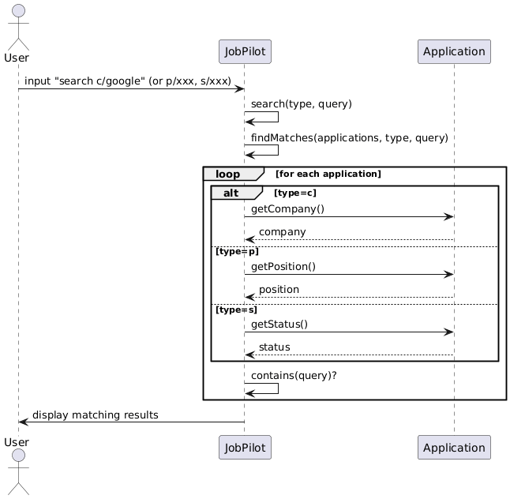
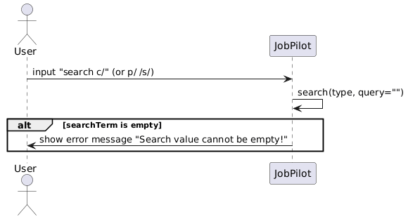
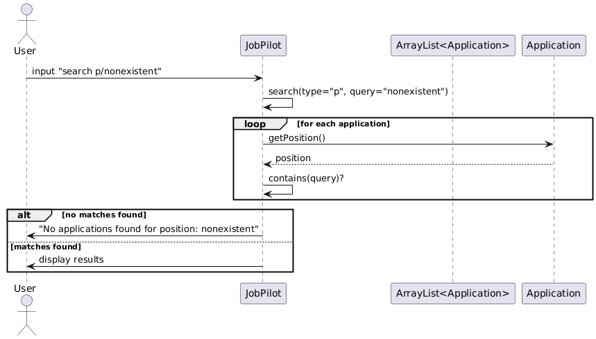
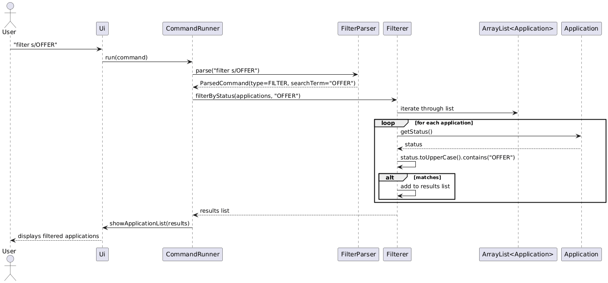
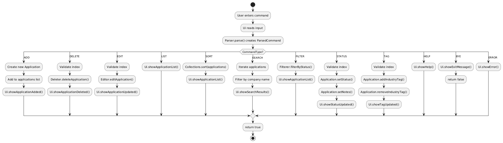

# Yan Xiangyu - Project Portfolio Page

## Overview
**JobPilot** is a command-line application that helps computing students track and manage job applications efficiently.

My main contributions focus on command execution and command behavior quality in `CommandRunner`, specifically the `sort`, `search`, and `filter` features. I also maintained core command dispatch reliability and updated the User Guide so that documentation accurately reflects implemented behavior.

## Summary of Contributions

### Code Contributed
*[Link to code on tP Code Dashboard](https://nus-cs2113-ay2526-s2.github.io/tp-dashboard/?search=&sort=groupTitle&sortWithin=title&timeframe=commit&mergegroup=&groupSelect=groupByRepos&breakdown=true&checkedFileTypes=docs~functional-code~test-code~other&since=2026-02-20T00%3A00%3A00&filteredFileName=&tabOpen=true&tabType=authorship&tabAuthor=Jas0n-yxy&tabRepo=AY2526S2-CS2113-W13-3%2Ftp%5Bmaster%5D&authorshipIsMergeGroup=false&authorshipFileTypes=docs~functional-code~test-code&authorshipIsBinaryFileTypeChecked=false&authorshipIsIgnoredFilesChecked=false)*

### Enhancements Implemented

#### 1. Sort Command (`sort`)
Implemented and enhanced multi-criteria sorting in the `CommandRunner` `SORT` branch.

Key Features:
- Supports sorting by `date`, `company`, and `status`.
- Supports ascending and descending order with optional `reverse`.
- Uses date ascending order as default sorting behavior.
- Sorting is non-destructive: it changes display order without deleting or mutating existing records.

Why this feature is complete:
- Supports all intended sort dimensions required by the command format.
- Handles both default behavior and user-requested reverse order.
- Integrates cleanly with list display flow after command execution.

Implementation complexity:
- Required centralizing argument parsing and comparator selection in command dispatch.
- Needed careful handling of optional `reverse` argument while preserving backward-compatible behavior.

#### 2. Search Command (`search`)
Implemented enhanced search behavior in the `CommandRunner` `SEARCH` branch.

Key Features:
- Multi-type search by `c/` (company), `p/` (position), and `s/` (status).
- Case-insensitive partial matching by default.
- `exact:` prefix support for exact matching.
- `!` prefix support for inverse filtering (exclude keyword).
- Search output is auto-sorted by date for consistent result presentation.

Why this feature is complete:
- Supports both normal usage and advanced usage in one command family.
- Covers broad queries and precise queries with predictable behavior.
- Handles no-match cases clearly and keeps output format consistent.

Implementation complexity:
- Resolved duplicate `case SEARCH` routing conflict during integration.
- Unified matching strategy across all prefixes so behavior is consistent.
- Balanced flexibility (partial + exact + inverse) without breaking basic command syntax.

#### 3. Filter Command (`filter`)
Enhanced status filtering behavior in the `CommandRunner` `FILTER` branch.

Key Features:
- Filters applications by status using case-insensitive partial matching.
- Adds defensive validation (non-empty input and length checks).
- Uses clearer output messaging for matched and no-match scenarios.

Why this feature is complete:
- Handles normal status filter usage and invalid inputs safely.
- Avoids common runtime issues from malformed or empty values.
- Produces stable and readable output for CLI users.

Implementation complexity:
- Required additional validation paths before filtering logic execution.
- Needed output standardization to match the project-wide UI style.

#### 4. CommandRunner Core Logic Maintenance
Maintained and stabilized the main command execution flow in `CommandRunner`.

Key Contributions:
- Fixed compile issue related to `Ui.getInstance()` usage.
- Removed and reconciled duplicate/conflicting command cases.
- Standardized enum-based command branch routing.
- Ensured `run()` method dispatch chain stays coherent after multiple feature merges.

Outcome:
- Reduced command dispatch instability during team integration.
- Improved overall reliability for build and CI checks.

### Contributions to Team-Based Tasks
- Coordinated command-level integration to reduce conflicts in central execution flow.
- Helped resolve CI blockers caused by command dispatch and compile errors.
- Assisted in keeping UG command descriptions aligned with implementation changes during team merges.

### Code Quality Contributions
- Added and refined concise English comments for `sort`, `search`, and `filter` branches.
- Kept implementation aligned with coding conventions and checkstyle expectations.
- Improved maintainability by keeping command behavior explicit and predictable.

## Contributions to the Developer Guide (Extracts)

### Sort Feature Documentation
Documented command semantics and supported forms:
- `sort date`
- `sort company`
- `sort status`
- `sort <date|company|status> reverse`

Documented design intent:
- default ordering strategy
- reverse ordering behavior
- non-destructive effect on existing data

### Search Feature Documentation
Documented enhanced search behavior:
- prefix-based dimensions (`c/`, `p/`, `s/`)
- case-insensitive partial matching
- exact matching using `exact:`
- inverse matching using `!`
- date-ordered output for consistency

Included normal and advanced usage scenarios.

### Filter Feature Documentation
Documented:
- status matching behavior
- validation rules for safe execution
- output behavior for matches and no-match cases

### Sequence Diagrams (My Feature Areas)
#### Search command flow

#### Search empty-term handling

#### Search no-match handling

#### Filter command flow

#### Command dispatch flow (CommandRunner-related)

## Contributions to the User Guide (Extracts)

### Sorting Applications: `sort`
Sorts all applications by a selected field. Default order is ascending; add `reverse` for descending.

**Format**
- `sort date`
- `sort company`
- `sort status`
- `sort <date|company|status> reverse`

**Examples**
- `sort date`
- `sort company reverse`
- `sort status`

### Searching Applications: `search`
Searches by company, position, or status with support for partial, exact, and inverse matching.

**Format**
- `search c/KEYWORD`
- `search p/KEYWORD`
- `search s/KEYWORD`
- `search c/exact:COMPANY_NAME`
- `search p/exact:POSITION_NAME`
- `search s/!STATUS`

**Examples**
- `search c/google`
- `search p/intern`
- `search c/exact:Google`
- `search s/!offer`

### Filtering Applications by Status: `filter`
Filters application list by status keyword.

**Format**
- `filter s/STATUS`

**Examples**
- `filter s/pending`
- `filter s/interview`
- `filter s/offer`

## Manual Testing Contributions (Extracts)

### Test Case: Sort by company in reverse order
1. Precondition: At least 3 applications exist with different company names.
2. Action: Run `sort company reverse`.
3. Expected: Applications are displayed in descending alphabetical order by company.

### Test Case: Exact search by company
1. Precondition: One application with company exactly `Google` exists.
2. Action: Run `search c/exact:Google`.
3. Expected: Only exact `Google` entries are displayed.

### Test Case: Inverse search by status
1. Precondition: Mixed statuses exist (e.g., `PENDING`, `OFFER`).
2. Action: Run `search s/!offer`.
3. Expected: All non-`offer` status applications are shown.

### Test Case: Filter validation
1. Action: Run `filter s/` (empty status).
2. Expected: Validation error message appears; program does not crash.
